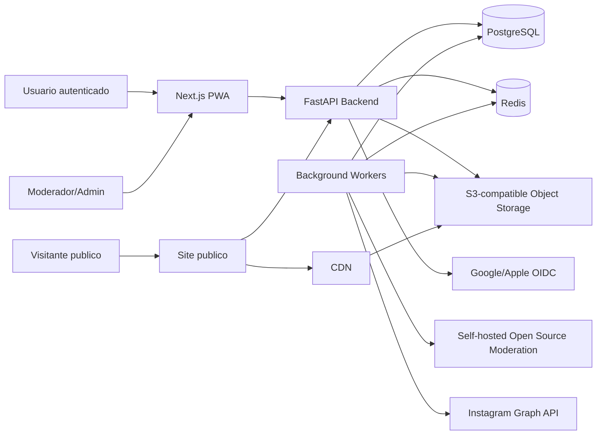
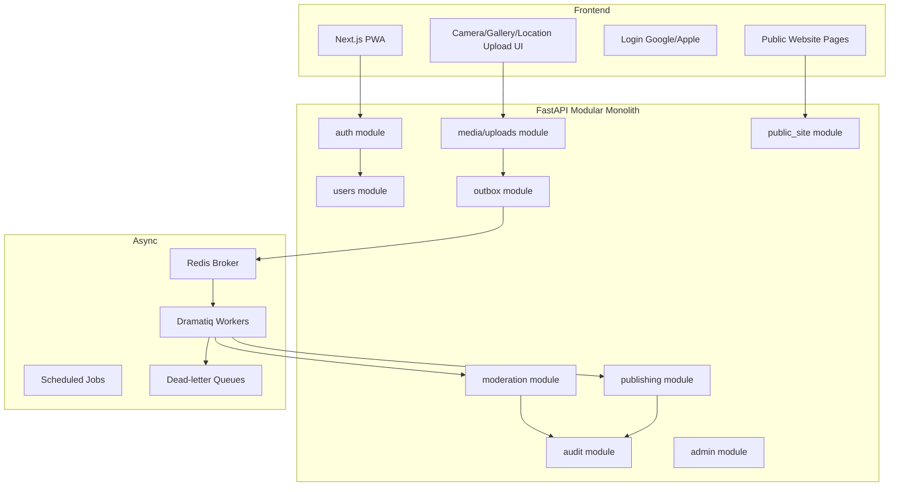
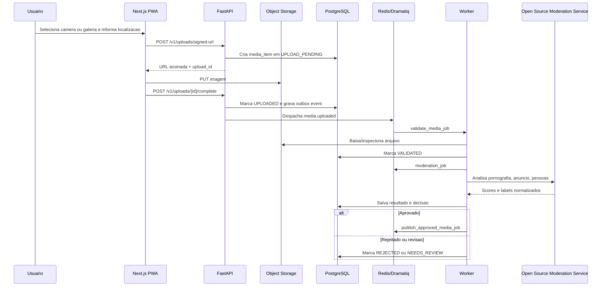
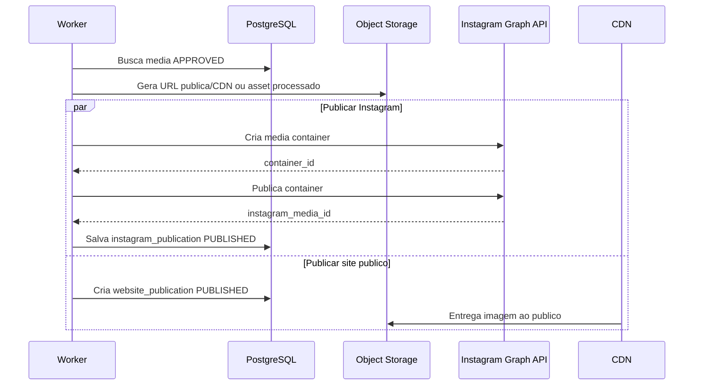
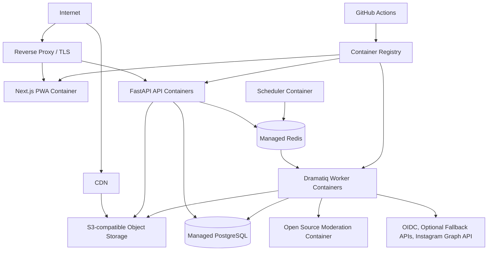

# MeuBuraco Architecture

## 1. Executive Summary

MeuBuraco is a production-ready MVP platform where authenticated users upload images with metadata and geolocation, the system automatically moderates those images, and approved content is published to Instagram and a public website.

The recommended architecture is a Python-first modular monolith:

- Backend: FastAPI, Python 3.12+, PostgreSQL, SQLAlchemy 2.0, Pydantic v2
- Async processing: Redis plus Dramatiq
- Storage: S3-compatible object storage behind a CDN
- Frontend: Next.js PWA
- Infrastructure: Docker, GitHub Actions, reverse proxy, API workers, background workers

The MVP should avoid microservices. A modular monolith keeps operational complexity low while still giving the codebase clean domain boundaries and a path to extract services later if traffic or team structure requires it.

All frontend user-facing text should be written in Portuguese (Brazil).

## 2. Architecture Diagrams

### System Context



### Component Diagram



### Upload and Moderation Sequence



### Publishing Sequence



### Infrastructure Topology



## 3. Tech Decisions

### Frontend Choice

Recommended MVP choice: Next.js PWA.

Comparison:

| Criteria | Expo + React Native Web | Next.js PWA |
| --- | --- | --- |
| Shared codebase | Strong for native/web | Strong for web/public site/admin |
| Mobile support | Best native mobile UX | Good mobile browser/PWA UX |
| Camera support | Excellent native APIs | Good via browser MediaDevices/file input |
| Fast MVP | More mobile setup and app-store overhead | Faster web deployment |
| Public website | Possible, but less natural | Excellent fit |
| Auth integration | Good | Excellent with OAuth web flows |
| Maintainability | Great if native apps are required | Simpler for web-first MVP |
| Deployment | App stores plus web | Standard web deployment |

Use Next.js PWA because the product requires a public website, browser-based authenticated upload flows, and fast MVP delivery. Camera capture can be handled with `<input type="file" accept="image/*" capture="environment">` plus progressive enhancement using MediaDevices where useful.

Use Portuguese (Brazil) for UI copy, for example:

- "Entrar com Google"
- "Entrar com Apple"
- "Enviar foto"
- "Tirar foto"
- "Escolher da galeria"
- "Descricao da imagem"
- "Data da imagem"
- "Localizacao da imagem"
- "Usar minha localizacao atual"
- "Aguardando moderacao"
- "Publicado"

### Backend

Use FastAPI with a modular monolith. Each domain module owns routers, schemas, services, repositories, models, and async actors. Keep one deployable API application and one worker deployment.

### Queue

Use Dramatiq with Redis for MVP. Dramatiq has a smaller conceptual surface than Celery, reliable middleware support, retries, and clear actor semantics. Celery is also valid if the team already has experience with it.

### Storage

Store original and derived images in S3-compatible object storage. Never proxy large uploads through the API. Use signed upload URLs and signed or CDN-backed public delivery URLs.

### AI Moderation

Prefer a self-hosted open source moderation stack for the MVP instead of provider-first moderation APIs. This keeps moderation costs predictable, reduces vendor lock-in, and allows the team to tune thresholds against local product policy.

Recommended MVP stack:

- Pornography/NSFW detection: NudeNet or OpenNSFW2-style model served behind an internal HTTP interface.
- People detection: YOLO-family object detection model with a maintained open source runtime.
- Advertisement detection: OCR plus visual classification. Start with Tesseract or PaddleOCR for text extraction and a small open source image/text classifier for ad-like content; route uncertain cases to human review.
- Model serving: a dedicated internal `moderation-service` container using FastAPI, ONNX Runtime, PyTorch, or a lightweight inference server depending on model choice.

Keep a moderation adapter interface so AWS Rekognition, Google Vision, or OpenAI vision models can be enabled later as fallback, benchmarking tools, or burst capacity, but they should not be the default path.

## 4. Data Model

### Core Status Enums

```text
media_status:
UPLOAD_PENDING, UPLOADED, VALIDATING, VALIDATED, MODERATING,
APPROVED, REJECTED, NEEDS_REVIEW, PUBLISHING, PUBLISHED,
PARTIALLY_PUBLISHED, PUBLISH_FAILED, ARCHIVED

moderation_status:
PENDING, RUNNING, APPROVED, REJECTED, NEEDS_REVIEW, FAILED

publish_target:
INSTAGRAM, WEBSITE

publish_status:
PENDING, RUNNING, PUBLISHED, FAILED, DEAD_LETTERED, SKIPPED
```

### Tables

#### users

| Column | Type | Notes |
| --- | --- | --- |
| id | uuid pk | Primary identity |
| email | citext unique | Verified email |
| display_name | text | User profile name |
| avatar_url | text nullable | OAuth avatar |
| role | text | USER, ADMIN, MODERATOR |
| is_active | boolean | Account state |
| created_at / updated_at | timestamptz | Audit timestamps |

Indexes:

- unique `users.email`
- index `users.role`

#### oauth_accounts

| Column | Type | Notes |
| --- | --- | --- |
| id | uuid pk | |
| user_id | uuid fk users.id | |
| provider | text | GOOGLE, APPLE |
| provider_subject | text | OIDC subject |
| email | citext | Provider email |
| created_at / updated_at | timestamptz | |

Constraints:

- unique `(provider, provider_subject)`
- index `oauth_accounts.user_id`

#### sessions

| Column | Type | Notes |
| --- | --- | --- |
| id | uuid pk | Session id |
| user_id | uuid fk users.id | |
| refresh_token_hash | text unique | Store hash only |
| expires_at | timestamptz | |
| revoked_at | timestamptz nullable | |
| user_agent | text nullable | |
| ip_address | inet nullable | |
| created_at / updated_at | timestamptz | |

Indexes:

- `sessions.user_id`
- `sessions.expires_at`

#### media_items

| Column | Type | Notes |
| --- | --- | --- |
| id | uuid pk | |
| user_id | uuid fk users.id | Owner |
| description | text | User-provided description |
| image_date | date | User-provided date |
| latitude | numeric(9,6) | Submission latitude |
| longitude | numeric(9,6) | Submission longitude |
| location_accuracy_meters | numeric nullable | Browser/device-reported accuracy |
| location_source | text | GPS, MANUAL, EXIF, ADMIN |
| location_label | text nullable | Optional user-facing address or reference |
| status | media_status | Main lifecycle state |
| moderation_decision | text nullable | APPROVED, REJECTED, NEEDS_REVIEW |
| rejection_reason | text nullable | |
| idempotency_key | text nullable | Client idempotency |
| created_at / updated_at | timestamptz | |

Indexes:

- `media_items.user_id, created_at desc`
- `media_items.status`
- `media_items.latitude, media_items.longitude`
- unique nullable `(user_id, idempotency_key)`

For production geospatial search, enable PostGIS and replace or supplement `latitude`/`longitude` with a generated `geography(Point, 4326)` column indexed with GiST.

#### media_assets

| Column | Type | Notes |
| --- | --- | --- |
| id | uuid pk | |
| media_item_id | uuid fk media_items.id | |
| kind | text | ORIGINAL, THUMBNAIL, WEB_OPTIMIZED |
| bucket | text | |
| object_key | text | |
| mime_type | text | |
| size_bytes | bigint | |
| width | integer nullable | |
| height | integer nullable | |
| sha256 | text nullable | Dedup/validation |
| created_at | timestamptz | |

Constraints:

- unique `(bucket, object_key)`
- unique `(media_item_id, kind)`

#### moderation_jobs

| Column | Type | Notes |
| --- | --- | --- |
| id | uuid pk | |
| media_item_id | uuid fk media_items.id | |
| engine | text | OSS_NUDENET, OSS_OPENNSFW2, OSS_YOLO, OSS_OCR_CLASSIFIER, AWS_REKOGNITION, GOOGLE_VISION, OPENAI |
| status | moderation_status | |
| attempts | integer | |
| last_error | text nullable | |
| idempotency_key | text unique | |
| started_at / completed_at | timestamptz nullable | |
| created_at / updated_at | timestamptz | |

#### moderation_results

| Column | Type | Notes |
| --- | --- | --- |
| id | uuid pk | |
| moderation_job_id | uuid fk moderation_jobs.id | |
| media_item_id | uuid fk media_items.id | |
| pornography_score | numeric | 0 to 1 |
| advertisement_score | numeric | 0 to 1 |
| people_score | numeric | 0 to 1 |
| labels | jsonb | Normalized model labels |
| raw_response | jsonb | Raw engine response |
| decision | text | APPROVED, REJECTED, NEEDS_REVIEW |
| created_at | timestamptz | |

Indexes:

- `moderation_results.media_item_id`
- gin `moderation_results.labels`

#### publish_jobs

| Column | Type | Notes |
| --- | --- | --- |
| id | uuid pk | |
| media_item_id | uuid fk media_items.id | |
| target | publish_target | |
| status | publish_status | |
| attempts | integer | |
| idempotency_key | text unique | |
| last_error | text nullable | |
| next_attempt_at | timestamptz nullable | |
| created_at / updated_at | timestamptz | |

Indexes:

- `publish_jobs.status, next_attempt_at`
- unique `(media_item_id, target)`

#### instagram_publications

| Column | Type | Notes |
| --- | --- | --- |
| id | uuid pk | |
| media_item_id | uuid fk media_items.id | |
| publish_job_id | uuid fk publish_jobs.id | |
| instagram_container_id | text nullable | |
| instagram_media_id | text nullable | |
| permalink | text nullable | |
| status | publish_status | |
| published_at | timestamptz nullable | |
| created_at / updated_at | timestamptz | |

#### website_publications

| Column | Type | Notes |
| --- | --- | --- |
| id | uuid pk | |
| media_item_id | uuid fk media_items.id | |
| publish_job_id | uuid fk publish_jobs.id | |
| slug | text unique | |
| title | text nullable | |
| status | publish_status | |
| published_at | timestamptz nullable | |
| created_at / updated_at | timestamptz | |

#### audit_logs

| Column | Type | Notes |
| --- | --- | --- |
| id | uuid pk | |
| actor_user_id | uuid nullable fk users.id | Null for system |
| action | text | e.g. MEDIA_APPROVED |
| entity_type | text | |
| entity_id | uuid | |
| metadata | jsonb | |
| ip_address | inet nullable | |
| user_agent | text nullable | |
| created_at | timestamptz | |

Indexes:

- `audit_logs.entity_type, entity_id`
- `audit_logs.actor_user_id, created_at desc`

#### outbox_events

| Column | Type | Notes |
| --- | --- | --- |
| id | uuid pk | |
| event_type | text | media.uploaded, media.approved |
| aggregate_type | text | media_item |
| aggregate_id | uuid | |
| payload | jsonb | |
| status | text | PENDING, DISPATCHED, FAILED |
| attempts | integer | |
| next_attempt_at | timestamptz nullable | |
| created_at / updated_at | timestamptz | |

Indexes:

- `outbox_events.status, next_attempt_at`
- `outbox_events.aggregate_type, aggregate_id`

## 5. API Design

All protected endpoints require `Authorization: Bearer <access_token>`.

### Authentication

#### `GET /v1/auth/google/login`

Starts Google OIDC login. Returns a redirect response.

#### `GET /v1/auth/apple/login`

Starts Apple OIDC login. Returns a redirect response.

#### `GET /v1/auth/callback/{provider}`

Handles OIDC callback, creates or links user, creates session, and returns secure cookies or redirects to the frontend with an authorization code.

#### `POST /v1/auth/refresh`

Request:

```json
{
  "refresh_token": "opaque_refresh_token"
}
```

Response:

```json
{
  "access_token": "jwt",
  "expires_in": 900
}
```

#### `POST /v1/auth/logout`

Revokes the current session.

### User Profile

#### `GET /v1/me`

Response:

```json
{
  "id": "uuid",
  "email": "usuario@example.com",
  "display_name": "Cesar",
  "role": "USER"
}
```

### Signed Uploads

#### `POST /v1/uploads/signed-url`

Request:

```json
{
  "filename": "foto.jpg",
  "mime_type": "image/jpeg",
  "size_bytes": 2481000,
  "description": "Buraco na rua principal",
  "image_date": "2026-05-23",
  "location": {
    "latitude": -23.55052,
    "longitude": -46.633308,
    "accuracy_meters": 18.4,
    "source": "GPS",
    "label": "Rua Direita, Centro, Sao Paulo"
  },
  "idempotency_key": "client-generated-key"
}
```

Response:

```json
{
  "media_item_id": "uuid",
  "asset_id": "uuid",
  "upload_url": "https://storage.example.com/signed-put",
  "headers": {
    "Content-Type": "image/jpeg"
  },
  "expires_in": 600
}
```

Error cases:

- `400` invalid MIME type or size
- `400` missing or invalid geolocation
- `401` unauthenticated
- `409` duplicate idempotency key
- `429` rate limited

#### `POST /v1/uploads/{media_item_id}/complete`

Request:

```json
{
  "asset_id": "uuid"
}
```

Response:

```json
{
  "media_item_id": "uuid",
  "status": "UPLOADED"
}
```

### Media

#### `GET /v1/media`

Returns authenticated user's media items.

#### `GET /v1/media/{media_item_id}`

Returns one media item and its statuses.

#### `PATCH /v1/media/{media_item_id}`

Allows metadata updates before publication.

Request:

```json
{
  "description": "Descricao atualizada",
  "image_date": "2026-05-23",
  "location": {
    "latitude": -23.55052,
    "longitude": -46.633308,
    "accuracy_meters": 12.0,
    "source": "MANUAL",
    "label": "Centro, Sao Paulo"
  }
}
```

### Moderation

#### `GET /v1/media/{media_item_id}/moderation`

Returns moderation status and final decision.

Admin users may see scores and labels. Normal users should only see simplified status.

### Publishing

#### `GET /v1/media/{media_item_id}/publishing`

Returns publication status by target.

#### `POST /v1/admin/media/{media_item_id}/republish`

Admin-only endpoint to enqueue failed or manual republishing.

### Admin Review

#### `POST /v1/admin/media/{media_item_id}/review`

Request:

```json
{
  "decision": "APPROVED",
  "reason": "Conteudo permitido"
}
```

### Public Website

#### `GET /v1/public/media`

Returns published website content. Supports optional location filters for map and nearby views:

- `bbox=min_lon,min_lat,max_lon,max_lat`
- `near=lat,lon`
- `radius_meters=1000`

Public responses should include an intentionally rounded or policy-approved display location unless exact coordinates are required by the product.

#### `GET /v1/public/media/{slug}`

Returns public detail page content.

## 6. Async Workflows

### Queues

- `media.validation`
- `media.moderation`
- `media.publishing`
- `integrations.instagram`
- `outbox.dispatch`
- `dead_letter`

### Events

- `media.upload_completed`
- `media.validated`
- `media.validation_failed`
- `media.moderation_requested`
- `media.moderation_completed`
- `media.approved`
- `media.rejected`
- `media.needs_review`
- `media.publish_requested`
- `media.instagram_published`
- `media.website_published`
- `media.publish_failed`

### Jobs

#### `dispatch_outbox_events`

Runs frequently. Reads pending outbox events and sends them to Dramatiq. Marks events as dispatched only after enqueue succeeds.

#### `validate_media_job(media_item_id, asset_id)`

Responsibilities:

- Confirm object exists in storage
- Validate max size
- Validate MIME using file signature, not only user-provided header
- Decode image and confirm dimensions
- Calculate SHA-256
- Validate required geolocation fields and coordinate ranges
- Normalize location source and accuracy metadata
- Optionally generate thumbnail and web-optimized asset
- Enqueue malware scan or perform inline with a scanning service

#### `scan_media_for_malware_job(media_item_id)`

Uses ClamAV service, provider API, or object-storage malware scanning integration. If malware is detected, mark media `REJECTED` and audit the decision.

#### `moderate_media_job(media_item_id)`

Uses the internal open source moderation service by default. The service runs model-specific detectors, normalizes their outputs, and returns pornography, advertisement, and people scores. The backend writes `moderation_jobs` and `moderation_results`, then applies decision thresholds.

The backend should depend on a `ModerationEngine` interface with implementations for:

- `OpenSourceModerationEngine`, the default MVP engine.
- `AwsRekognitionModerationEngine`, optional fallback.
- `GoogleVisionModerationEngine`, optional fallback.
- `OpenAIVisionModerationEngine`, optional fallback or second opinion.

Suggested thresholds:

- Pornography score >= 0.80: reject
- Advertisement score >= 0.80: reject
- People score >= 0.70: needs review or reject depending product policy
- Any model uncertainty: needs review

#### `publish_approved_media_job(media_item_id)`

Creates target-specific publish jobs for website and Instagram. Uses unique `(media_item_id, target)` to avoid duplicates.

#### `publish_to_instagram_job(publish_job_id)`

Calls Instagram Graph API using an idempotency key. Handles token refresh, rate limits, temporary failures, and permanent failures.

#### `publish_to_website_job(publish_job_id)`

Creates the public website publication row and makes the content visible to the public API.

### Retry Strategy

- Validation failures caused by invalid user files are permanent.
- Moderation service/model failures retry with exponential backoff.
- Instagram rate limits retry using provider-supplied reset time where available.
- After max attempts, mark job `DEAD_LETTERED` and create an audit log.

Suggested retry policy:

- Attempts: 5
- Backoff: 1m, 5m, 15m, 1h, 6h
- Jitter: enabled

### Idempotency

Use idempotency keys for:

- Signed upload creation
- Moderation jobs
- Publish jobs
- Instagram publication steps
- Website publication slug creation

Workers must be safe to run more than once. Each job should load current database state and no-op if the target state already exists.

## 7. Security

### OAuth2/OIDC

Use Google and Apple as OIDC providers. Validate issuer, audience, expiry, nonce, and signature. Use provider subject as the stable external account key.

### JWT Strategy

- Access token lifetime: 15 minutes
- Refresh token lifetime: 30 days
- Access token includes user id, role, session id, and token version
- Refresh tokens are opaque random values stored hashed in `sessions`
- Rotate refresh tokens on use
- Revoke sessions on logout

For browser clients, prefer secure, HttpOnly, SameSite cookies for refresh tokens. Access tokens can be kept in memory and refreshed silently.

### Signed Uploads

- API creates object key with user/media scoped prefix
- Upload URL expires in 10 minutes
- Enforce content length and MIME constraints
- Validate file again after upload
- Never trust filename or client MIME type

### File Validation

Allow only:

- JPEG
- PNG
- WebP, if product requirements allow it

Set strict max file size, for example 10 MB for MVP. Strip metadata from public derivatives to reduce privacy risk.

### Geolocation Validation and Privacy

Image submission requires geolocation. The frontend should request browser location permission during the upload flow and also allow the user to manually adjust the location before submission.

Validation rules:

- Require latitude and longitude for every submitted image.
- Latitude must be between `-90` and `90`.
- Longitude must be between `-180` and `180`.
- Reject `GPS` submissions with missing or impossible `accuracy_meters`.
- Store `location_source` as `GPS`, `MANUAL`, `EXIF`, or `ADMIN`.
- Do not trust EXIF GPS metadata as the only source; treat it as a hint and require explicit user confirmation.
- Keep full-precision coordinates for internal moderation/admin workflows.
- Public website responses should round, mask, or neighborhood-label coordinates according to product privacy policy.
- Strip EXIF metadata from public image derivatives so hidden device GPS metadata is not published.

### Malware Scanning

MVP options:

- Run a ClamAV scanner container for uploaded objects
- Use an object-storage malware scanning integration
- Use a third-party scanning API

Treat positive detections as permanent rejection and record an audit log.

### CORS and CSRF

- Allow only configured frontend origins
- Use strict methods and headers
- If using cookies for auth, enable CSRF tokens for state-changing requests
- If using bearer tokens only, CSRF risk is lower, but XSS prevention remains critical

### API Throttling

Rate-limit by:

- IP address for unauthenticated routes
- User id for authenticated routes
- Endpoint class for expensive operations

Example limits:

- Login: 10 attempts per 10 minutes per IP
- Signed upload: 30 per hour per user
- Admin actions: conservative but not disruptive

### Secrets Management

Use environment-specific secret stores:

- Production: cloud secret manager or platform secret store
- Development: `.env` excluded from git
- CI/CD: GitHub Actions encrypted secrets

Rotate Instagram, OAuth, JWT, and storage credentials.

### Audit Logs

Audit:

- Login and logout
- Upload creation/completion
- Geolocation creation or edits
- Moderation decisions
- Admin review decisions
- Publishing attempts and failures
- Token refresh failures for integrations

## 8. Infrastructure

### Monorepo Structure

```text
meuburaco/
  apps/
    api/
      app/
        main.py
        core/
        modules/
          auth/
          users/
          media/
          moderation/
          publishing/
          public_site/
          audit/
          admin/
          outbox/
        db/
        workers/
        tests/
      alembic/
      pyproject.toml
      Dockerfile
    moderation-service/
      app/
        main.py
        engines/
          nsfw/
          people/
          advertising/
        schemas.py
      models/
      tests/
      pyproject.toml
      Dockerfile
    web/
      app/
      components/
      features/
      lib/
      public/
      tests/
      package.json
      Dockerfile
  packages/
    contracts/
      openapi/
      generated/
  infra/
    docker-compose.yml
    nginx/
    terraform/
  docs/
    architecture.md
  .github/
    workflows/
      ci.yml
      deploy.yml
```

### Containers

- `web`: Next.js PWA
- `api`: FastAPI app
- `moderation-service`: internal open source model inference API
- `worker`: Dramatiq workers
- `scheduler`: recurring outbox dispatch and maintenance jobs
- `postgres`: development database
- `redis`: broker/cache
- `nginx`: reverse proxy/TLS termination in self-managed deployments

### CI/CD

GitHub Actions should run:

- Python linting and formatting
- Type checking
- Unit tests
- Migration checks
- Frontend linting
- Frontend tests
- Docker image build
- Security/dependency scanning
- Deployment to staging, then production

### Migration Strategy

Use Alembic. Run migrations as a separate release step before deploying API containers. For risky schema changes, use expand-and-contract migrations.

### Health Checks

- `/health/live`: process is alive
- `/health/ready`: database, Redis, storage connectivity
- Worker heartbeat metrics
- Queue depth alarms

## 9. Scaling Strategy

### Millions of Uploads

The API remains stateless and horizontally scalable. Upload traffic goes directly to object storage using signed URLs, avoiding API bottlenecks.

Scale independently:

- API containers by request load
- Worker containers by queue depth
- PostgreSQL read replicas for public read traffic if needed
- CDN for public image delivery
- Object storage lifecycle rules for cost control

### Database

Indexes should support:

- User media lists
- Status-based worker scans
- Public website lists
- Location-based public search
- Audit lookup by entity

For very large scale:

- Enable PostGIS and use GiST indexes for radius, bounding-box, and map queries
- Partition `audit_logs` by month
- Partition `outbox_events` by month or status/time
- Archive old moderation raw responses
- Move public content reads to cache or read replica

### CDN and Public Website

Use CDN caching for image assets with long TTLs and immutable object keys. Public API responses can use short TTLs or ISR-style caching from Next.js.

### Worker Scaling

Use separate worker pools by queue:

- Validation workers need CPU/image processing capacity
- Moderation workers may be CPU/GPU-bound when using self-hosted models; scale them separately from API and publishing workers
- Publishing workers need careful rate-limit control

## 10. Risks & Tradeoffs

### Key Risks

| Risk | Impact | Mitigation |
| --- | --- | --- |
| Instagram API rate limits or review delays | Publishing failures | Retry, status tracking, manual republish, operator alerts |
| Moderation false positives | Good content blocked | Threshold tuning, labeled evaluation sets, and human review extension |
| Moderation false negatives | Unsafe content published | Conservative policy, audit logs, model benchmarking, and optional provider fallback |
| Browser camera inconsistency | Poor mobile UX | Use file capture fallback and test target devices |
| Location permission denial | Upload cannot be completed | Provide manual map/address selection and clear Portuguese guidance |
| Precise location privacy risk | User safety or compliance issues | Store precise coordinates internally, publish rounded or policy-approved locations |
| Public traffic spikes | Website slowdown | CDN-first asset delivery and page caching |
| Large upload abuse | Cost and security exposure | Rate limits, signed URL expiry, file validation, quotas |

### Tradeoffs

- Modular monolith over microservices: lower operational burden for MVP, with clear module boundaries for later extraction.
- Next.js PWA over Expo: faster public website and admin delivery, acceptable camera support for MVP.
- Dramatiq over Celery: simpler worker model, enough reliability for this use case.
- S3 direct uploads over API uploads: more secure and scalable, but requires careful completion and validation workflow.
- Open source moderation over provider-first APIs: lower variable cost and stronger control, but requires model evaluation, container sizing, and ongoing threshold tuning.

### Cost Optimization

- Store originals in infrequent-access storage after a retention window.
- Generate web-optimized images and thumbnails once, then serve via CDN.
- Strip metadata and compress derivatives.
- Cache public pages and image assets aggressively.
- Use one self-hosted open source moderation stack for MVP, keep the abstraction ready for provider fallback only when needed.
- Batch moderation jobs where latency allows and reuse warm model containers.
- Limit raw model response retention.
- Autoscale workers by queue depth.
- Apply log retention policies.

### Future Roadmap

1. Human moderation console with queues and reviewer notes.
2. More social targets beyond Instagram.
3. Video upload and moderation.
4. Analytics dashboard for uploads, approvals, and publishing success.
5. Full-text and geospatial content search.
6. Abuse prevention with quotas, reputation, and anomaly detection.
7. Multi-tenant support.
8. Public feed personalization.
9. Extraction of moderation or publishing into separate services if throughput or team ownership requires it.
